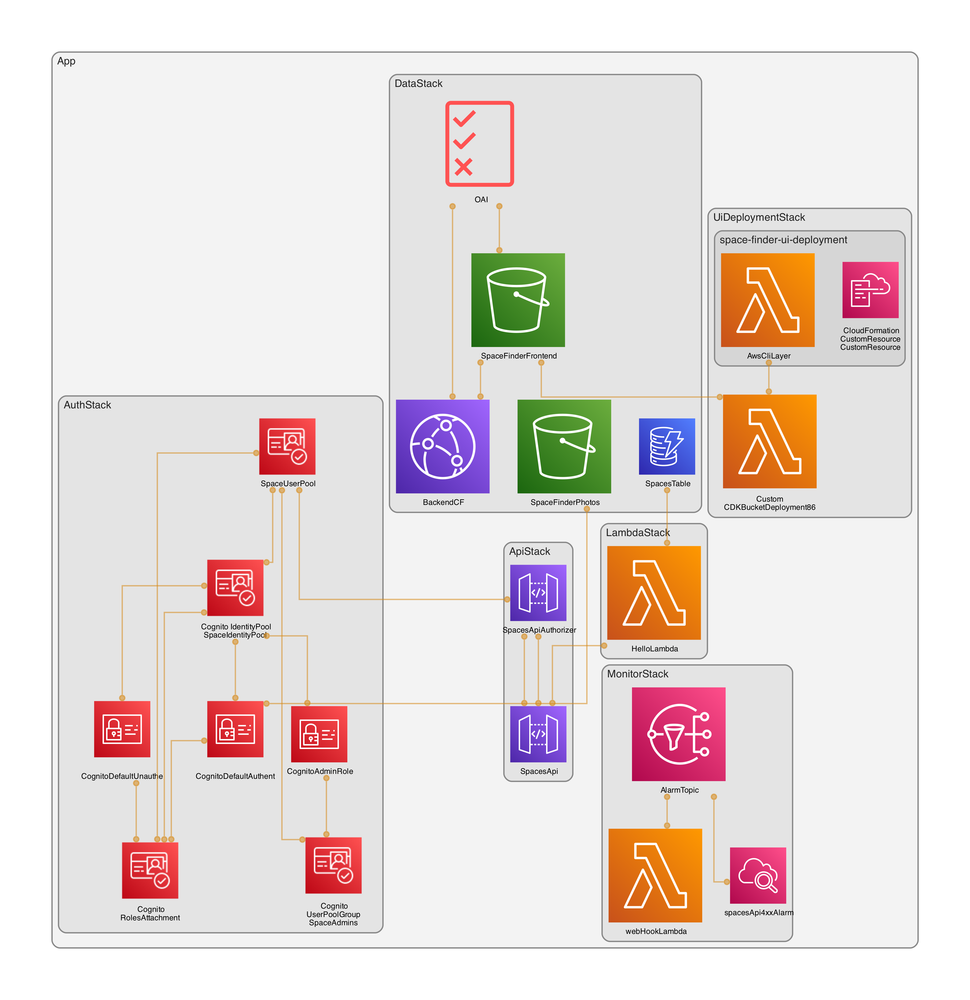

# I n f r a - generated by cdk-dia



## 🚀 Getting Started

### Prerequisites

To deploy and test this project, you'll need..

- Basic experience with AWS CDK

- An AWS account with appropriate permissions

- Node.js and npm installed

<hr>

### Required for all deployments

‼️ Create a <strong>.env</strong> file in the root of the project with the following value

`AWS_REGION=us-east-1`

### Required for Webhook integration (e.g., Slack)

`WEBHOOK_URL=https://hooks.slack.com/services/...`

### Required only for testing AuthService.ts

`USERPOOL_ID=us-east-1_XXXXXXX`
`USERPOOL_CLIENT_ID=XXXXXXXXXXXXXX`
`IDENTITY_POOL_ID=us-east-1:xxxxxxxx-xxxx-xxxx-xxxx-xxxxxxxxxxxx`

## Authentication

⏭️ To enable authentication and test the flow

- Create a user in the Cognito User Pool.

- Create and assign the user to the admins2 group (created by the stack, go inside Cognito and assign it).

- Confirm the user’s password using the AWS CLI:

```sh aws cognito-idp admin-set-user-password \
 --user-pool-id us-east-1_XXXXXXX \
 --username <your-username> \
 --password "<YourSecurePassword123>" \
 --permanent \
 --region us-east-1
```

✅ Once confirmed, you’ll be able to retrieve a valid JWT IdToken.

## Full Stack Deployment

- To deploy all stacks:
  `npm run deploy`

⚠️ Make sure your .env file is set up correctly. CDK will output important references used by other stacks (e.g., frontend consuming backend API URLs).

## UI DEPLOYMENT STACK OR ONLY API SERVICE

### UI Deployment ( Optional )

- If you only want to deploy the backend (API service), comment out the UI deployment stack in the CDK app.

### If you want the full deployment (backend + frontend)

- Place both cdk-starter-back and cdk-starter-front in the same parent directory (but not nested inside each other).

- Ensure both stacks can reference each other's output.

- Run: `npm run deploy`

✅ You can freely comment out any stack in src/infra/Launcher.ts to test it in isolation.

📚 This setup is ideal for learning how each AWS service works in context (e.g., Lambda, Cognito, API Gateway, CloudFront, etc.).
